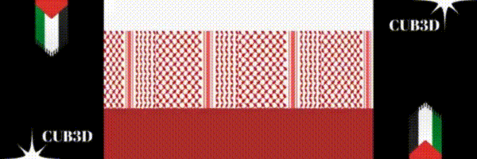

<!-- <!DOCTYPE html> -->
<!-- <html>
<head>
    <title>Gameplay Video</title>
</head>
<body>
    <video src="CUB3D.mp4" controls width="640"></video>
</body>
</html> -->
<div align="center">
  
</div>
# 3D Raycasting Game Engine

This project implements a raycasting-based rendering engine inspired by classic games like Wolfenstein 3D. It includes key features such as map validation, 2D rendering, wall projection, and texture mapping.

## Table of Contents
1. [Parse Map](#1-parse-map)
1. [Parse Map](#1-parse-map)
2. [2D Rendering](#2-2d-rendering)
3. [Wall Rendering](#3-wall-rendering)
4. [Texture Mapping](#4-texture-mapping)
5. [Resources](#5-Additional-Resources)
6. [How to Play](#6-how-to-play)

### 1. Parse Map

1- Check that the input file (`av[1]`) has:
  - A `.cub` extension.
  - Proper read permissions.
  
  2- Verify map elements:
  - Types (e.g., `NO`, `SO`, `WE`, `EA`) must be in strict order.
  - Paths for textures must have a `.xpm` extension.
  - Colors (`F` for floor, `C` for ceiling) should have RGB values in the range `[0, 255]`.
  
  3- Validate the map:
  - The map must be enclosed by `1`s (walls).
  - Any spaces within the map should also be enclosed by `1`s.
  - Ensure exactly one player exists.

## 2. 2D Rendering

We use raycasting to render the 2D map. Several algorithms can achieve this, including:
- **DDA (Digital Differential Analyzer)**
- **Bresenham's Line Algorithm** (used in this project).

   * [YouTube Video 1](https://youtu.be/RGB-wlatStc?si=jPJkp7XhoeITUuml)
   * [YouTube Video 2](https://youtu.be/CceepU1vIKo?si=E9myLNi9-4g3rhT_)
   * [GeeksforGeeks Article](https://www.geeksforgeeks.org/bresenhams-line-generation-algorithm/)

## 3. Wall Rendering

To render walls:
1. Use **Thales's theorem** to calculate `wall_height`:

   - Adjust the wall distance with `cos(ray_angle - player_angle)`.
   - Calculate the projection distance using:
     ```c
     dis_to_proj = (WIDTH / 2) / tan(FOV / 2);
     wall_height = round((dis_to_proj / precise_dist) * WALL_DIM);
     ```
2. Determine the wall's start and end positions on the screen:
```c
    start = (HEIGHT / 2) - (wall_height / 2)
   end = (HEIGHT / 2) + (wall_height / 2)
   ```

Here is a GitHub repository that helped me understand this part:
   * [Tutorial](https://github.com/Toufa7/Cub3D)

3. Render:
   - Draw the ceiling, walls, and floor in separate loops.
```c
	int	i;

	i = 0;
	while (i < start)
	{
		my_mlx_pixel_put(&data->mlx, p0.x_ind, i, data->map.c_color);
		i++;
	}
	i = draw_textures(data, i, end, p0);
	while (i < HEIGHT)
	{
		my_mlx_pixel_put(&data->mlx, p0.x_ind, i, data->map.f_color);
		i++;
	}
}
```
## 4. Texture Mapping

- After determining the wall's orientation (horizontal or vertical), identify the facing direction (`NO`, `SO`, `WE`, `EA`).
- Calculate texture offsets (`offset_x` and `offset_y`) for each ray.
```c
void	bresenham(t_point p0, double alpha, t_data *data, int i)
{
	t_bres_flag	s;
	int			e2;

	init_bresenham(data, p0, alpha, &s);
	while (1)
	{
		if (check_wall(p0, alpha, data, i))
			break ;
		e2 = s.err * 2;
		if (e2 > -s.dy)
		{
			s.err -= s.dy;
			p0.x_ind += s.sx;
			data->map.p.flag = HOR;
		}
		else if (e2 < s.dx)
		{
			s.err += s.dx;
			p0.y_ind += s.sy;
			data->map.p.flag = VER;
		}
	}
}
```

```c
int	check_texture(t_data *data)
{
	if (!data->map.p.flag)
	{
		data->map.p.offset_x = data->text.width - fmod(data->map.p.hit_x,
				WALL_DIM) / WALL_DIM * data->text.width;
		if (data->map.p.ray_angle > 0 && data->map.p.ray_angle < PI)
			return (data->texts[0].name = data->map.south, 0);
		else
			return (data->texts[1].name = data->map.north, 1);
	}
	else
	{
		data->map.p.offset_x = fmod(data->map.p.hit_y, WALL_DIM) / WALL_DIM
			* data->text.width;
		if (data->map.p.ray_angle > (3 * PI) / 2 || data->map.p.ray_angle < PI
			/ 2)
			return (data->texts[2].name = data->map.east, 2);
		else
			return (data->texts[3].name = data->map.west, 3);
	}
	return (0);
}
int	draw_textures(t_data *data, int i, int end, t_point p0)
{
	int		color;
	int		j;
	double	distance_from_top;
	double	texture_offset_y;

	j = check_texture(data);
	while (i < end)
	{
		distance_from_top = i + (data->map.p.wall_height / 2) - (HEIGHT / 2);
		texture_offset_y = distance_from_top * ((double)data->text.height
				/ data->map.p.wall_height);
		if (data->map.p.offset_x <= data->text.width
			&& data->map.p.offset_x >= 0
			&& texture_offset_y <= data->text.height && texture_offset_y >= 0)
		{
			color = *(int *)(data->texts[j].t.addr + ((int)texture_offset_y
						* data->texts[j].t.line_len)
					+ ((int)data->map.p.offset_x * (data->texts[j].t.bpp / 8)));
		}
		my_mlx_pixel_put(&data->mlx, p0.x_ind, i, color);
		i++;
	}
	return (i);
}
```


## 5. Additional Resources


* [tutorial 1](https://permadi.com/1996/05/ray-casting-tutorial-7/)
* [tutorial 2](https://permadi.com/tutorial/raycast/rayc10.html)
* [convert_to_xpm](https://convertio.co/png-xpm/)
* [for_images](https://sketchfab.com/3d-models/smg-fps-animations-ca37ea9148dc4fcc9cc632175d311b23)
 


## 6. How to Play

``` git clone git@github.com:saitamm/Cub3d.git ```

don't mess to install the minilibix-linux (in your intra)

```make```
## 🎮 Controls

Our Wolfenstein-inspired game supports the following movement and rotation controls:

### ⌨️ Keyboard Controls
- **W**: ⬆️ Move Forward  
- **S**: ⬇️ Move Backward  
- **A**: ⬅️ Strafe Left *(move sideways to the left)*  
- **D**: ➡️ Strafe Right *(move sideways to the right)*  
- **⬅️ Left Arrow**: Rotate Left *(turn left)*  
- **➡️ Right Arrow**: Rotate Right *(turn right)*  

### 🎉 Bonus Features
- **G**: 🔫 Change your gun *(you'll find a surprise waiting!)*  
- After changing the gun, press:  
  - **N**: 🎵 Something cool might happen!  
  - **M**: 🎵 Another surprise awaits!  

### ⚠️ Important Note
📥 **Don't forget to download MiniLibX Linux from the intra .** It's required for the game to work properly!
